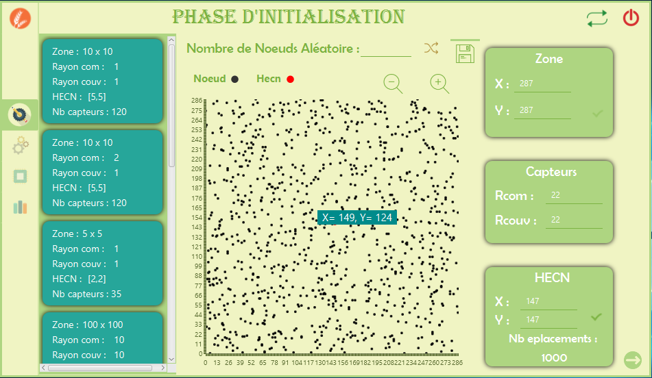
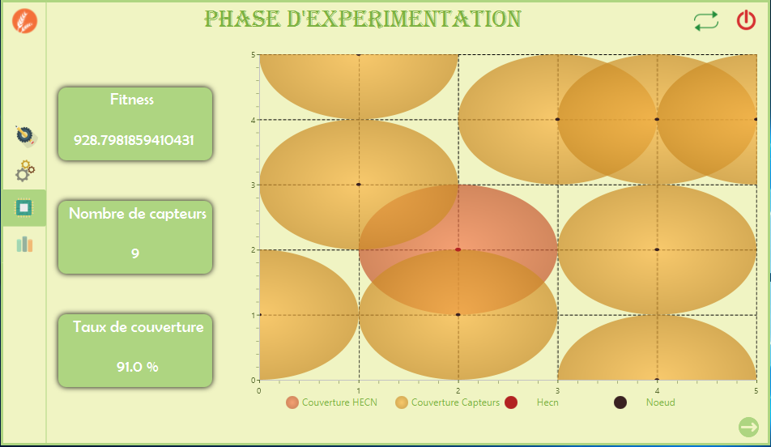
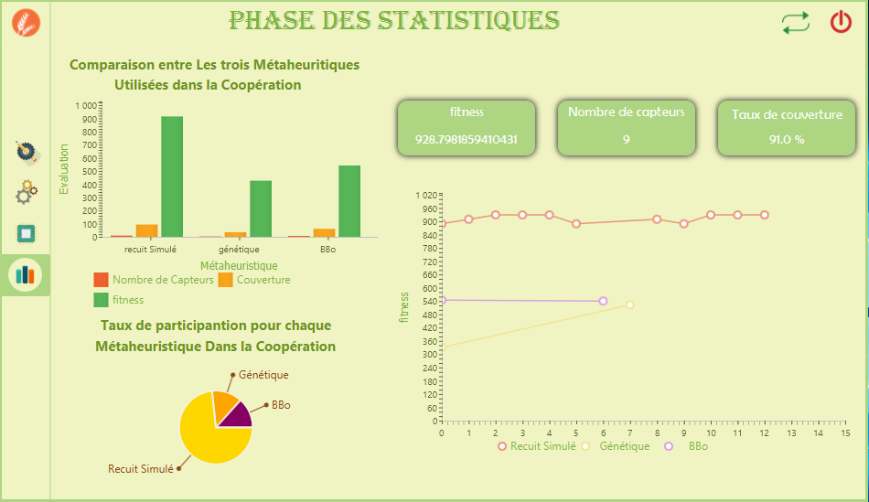

<H1> Minimization of the number of sensors in a WSN sensor network using metaheuristic cooperation </h1>

  <H6> University of Science and Technology USTHB </H6>
  <H6> IT department </H6>
  <H6> End-of-study project in license year (2018/2019) </H6>

<H3> Problematic : </H3>
In order to better exploit the performance and obtain the best expected results from
sensors, these are not placed in fields and work surfaces at
chance, everything must be well estimated and well calculated according to specific methodologies.
In our study above, we have agricultural land that we want to equip with a
WSN network and we are looking to obtain the ideal combination that will allow us to cover the
comprehensiveness of the field for better management of the latter while minimizing the most
possible costs.
Since our problem is similar to the Radio Network Design (RND) problem
which consists in finding the best radio layout composing the network for
maximize the coverage area while using the minimum radio, so it is up to
the class of problems say NP-DIFFICILES. 

<H3> Resolution : </H3>
Cooperation algorithm between these three metaheuristics:
<ul>
 <li> <H4> Simulated annealing algorithm </H4> </li> 
 <li> <H4> Genetic algorithm </H4> </li> 
 <li> <H4> Biogeography-based optimization algorithm </H4> </li> 
</ul>

<H3> Software used : </H3>
<ul>
 <li> <H4> Java </H4> </li> 
 <li> <H4> JavaFX with sceneBuilder </H4> </li> 
</ul>

<H3> Software screens : </H3>
<ul>
 <li> <H4> First Step </H4> </li> 
      
 <li> <H4> Second Step </H4> </li> 
      
 <li> <H4> Third Step </H4> </li> 
      
 <li> <H4> Fourth Step </H4> </li> 
      
</ul>
